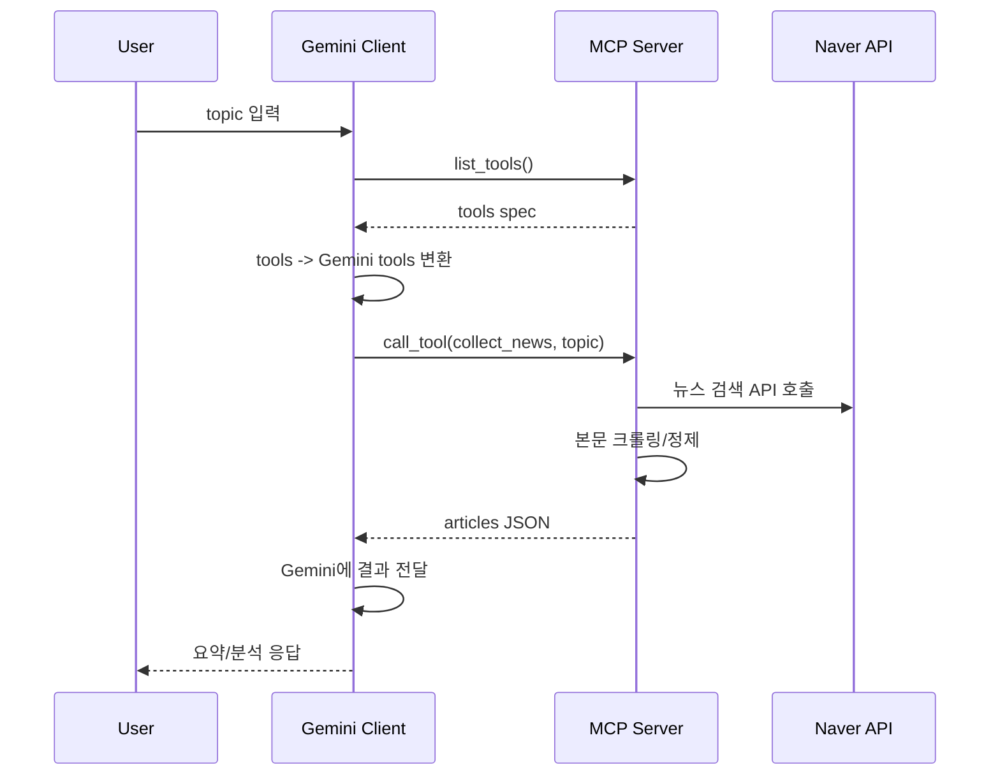

# Naver News MCP

FastMCP 서버가 네이버 뉴스 검색 API와 통신해 기사 본문을 수집하고, MCP 호환 LLM(예: Gemini)이 **도구 호출(Tool Calling)** 방식으로 `collect_news`를 실행해 요약·분석까지 수행하도록 돕는 프로젝트입니다.

## 핵심 기능

* **MCP Tool**: `collect_news(topic)`

  * 네이버 뉴스 검색 → 본문 크롤링 → `{title, url, text}` JSON 반환
* **Prompt Templates**

  * `news_query_prompt`, `summarize_articles_prompt`, `analyze_trends_prompt` 등 제공
* **실행 환경**

  * Local(uv), Docker Compose, Kubernetes 배포 지원(선택)

## 아키텍처

* `mcp-server`: FastMCP 기반 서버 (Naver API + 본문 크롤링)
* `mcp-client`: Gemini SDK 기반 클라이언트 (tools 동적 로딩 + function call 루프)

### 동작 흐름(요약)

1. Client가 MCP 서버에 `list_tools()` 요청
2. Gemini tools로 변환하여 모델에 등록
3. 사용자가 topic 입력
4. Gemini가 `collect_news` function call 생성
5. Client가 MCP Tool 실행 후 결과(JSON)를 Gemini에게 전달
6. Gemini가 요약/분석 결과를 응답

(선택) Mermaid 다이어그램 추가:



---

## 요구사항

* Python 3.12+
* [uv](https://docs.astral.sh/uv/)
* (선택) Docker / Kubernetes
* Naver Developers Open API 계정
* Google AI Studio 계정 및 `GEMINI_API_KEY`

## 환경 변수(.env)

`.env.example`을 복사해 `.env`를 만들고 API 키를 입력합니다.

```bash
cp .env.example .env
```

`.env` 예시:

```ini
NAVER_CLIENT_ID="..."
NAVER_CLIENT_SECRET="..."
GEMINI_API_KEY="..."
MCP_SERVER_URL="http://mcp-server:8000/"
```


---

## 빠른 시작 (Local)

```bash
uv sync
uv pip install google-genai
uv run --env-file .env python src/mcp_server/server.py
```

새 터미널에서 클라이언트 실행:

```bash
uv run --env-file .env python client/client.py
```

---

## MCP Tool 명세

### `collect_news(topic: str) -> List[Article]`

* 입력: `topic` (예: `"AI 반도체"`)
* 출력: 아래 형태의 JSON 리스트

예시:

```json
[
  {
    "title": "기사 제목",
    "url": "https://n.news.naver.com/...",
    "text": "정제된 본문 텍스트 ..."
  }
]
```

---

## Docker Compose 실행 (선택)

```bash
docker compose up --build
```

---

## Kubernetes 배포 (선택)

### 1) Secret 생성

```bash
kubectl create secret generic mcp-secrets --from-env-file=.env
```

### 2) 리소스 배포

```bash
kubectl apply -f ai-news.yaml
```

### 3) 클라이언트 실행

```bash
kubectl exec -it mcp-client -- python client/client.py
```

---

## 트러블슈팅

* 서버 시작 시 `NAVER_CLIENT_ID/SECRET` 미설정 → `.env` 확인
* `403/429` 반복 → 네이버 호출 제한 확인, 요청 빈도/`display` 값 조정, User-Agent/Referer 점검
* Gemini 응답 비어 있음 → 쿼터/지역/프롬프트 길이 확인
* 본문이 비어 있음 → 네이버 기사 레이아웃 변경 가능. selector 후보 업데이트 필요

